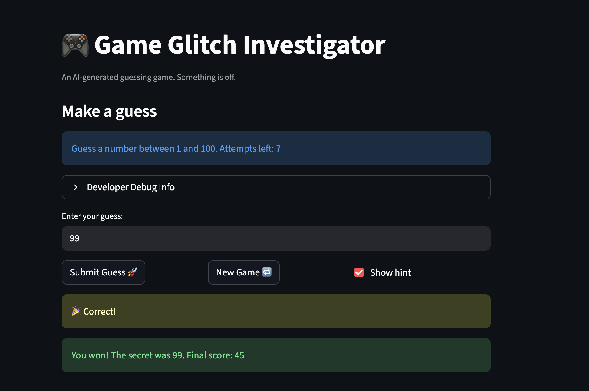

# 🎮 Game Glitch Investigator: The Impossible Guesser

## ✅ Summary 

The core concept was separating game logic from UI and keeping data types consistent. The main bug came from converting the secret number to a string, which broke comparisons. Students will likely struggle with type mismatches and understanding Streamlit reruns and session state. AI was helpful in identifying the string conversion bug and suggesting refactoring. It was misleading when it suggested keeping unnecessary try/except code. I would guide a student by asking them to check the variable types during comparison instead of pointing directly to the fix.

## 🚨 The Situation

You asked an AI to build a simple "Number Guessing Game" using Streamlit.
It wrote the code, ran away, and now the game is unplayable. 

- You can't win.
- The hints lie to you.
- The secret number seems to have commitment issues.

## 🛠️ Setup

1. Install dependencies: `pip install -r requirements.txt`
2. Run the broken app: `python -m streamlit run app.py`

## 🕵️‍♂️ Your Mission

1. **Play the game.** Open the "Developer Debug Info" tab in the app to see the secret number. Try to win.
2. **Find the State Bug.** Why does the secret number change every time you click "Submit"? Ask ChatGPT: *"How do I keep a variable from resetting in Streamlit when I click a button?"*
3. **Fix the Logic.** The hints ("Higher/Lower") are wrong. Fix them.
4. **Refactor & Test.** - Move the logic into `logic_utils.py`.
   - Run `pytest` in your terminal.
   - Keep fixing until all tests pass!

## 📝 Document Your Experience

- [ ] Describe the game's purpose.

The game is a number guessing game where the player tries to guess a secret number within a certain range. The app gives feedback like “Too High” or “Too Low” until the correct number is guessed.

- [ ] Detail which bugs you found.

The main bug was that the secret number was sometimes converted to a string, which broke the comparison logic and caused inconsistent hints. The game logic was also mixed with the UI code, making it harder to debug and test.

- [ ] Explain what fixes you applied.

I removed the string conversion so the secret number is always an integer. I simplified the check_guess() function to use clean integer comparisons and removed unnecessary try/except code. I also refactored the core logic into logic_utils.py to separate it from the Streamlit UI.

## 📸 Demo

- [ ] [Insert a screenshot of your fixed, winning game here]

## 🚀 Stretch Features

- [ ] [If you choose to complete Challenge 4, insert a screenshot of your Enhanced Game UI here]
